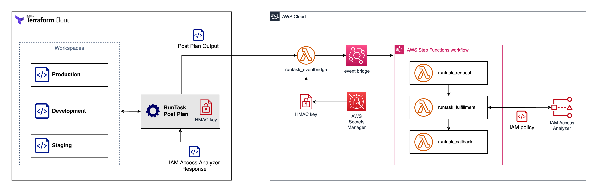

<!-- BEGIN_TF_DOCS -->
# terraform-runtask-iam-access-analyzer

Use this module to integrate Terraform Cloud Run Tasks with AWS IAM Access Analyzer for policy validation.



## Prerequisites

To use this module you need have the following:

1. AWS account and credentials
2. Terraform Cloud with Run Task entitlement (Business subscription or higher)

## Usage

* Build and package the Lambda files

  ```
  make all
  ```

* Refer to the [module\_workspace](./examples/module\_workspace/README.md) for steps to deploy this module in Terraform Cloud.

* After you deployed the [module\_workspace](./examples/module\_workspace/README.md), navigate to your Terraform Cloud organization, go to Organization Settings > Integrations > Run tasks to find the newly created Run Task.

* You can use this run task in any workspace where you have standard IAM resource policy document. Refer to the [demo\_workspace](./examples/demo\_workspace/README.md) for more details.

## Limitations

1. Does not provide verbose error / warning messages in Run Task console. In the future, we will explore possibility to provide verbose logging.

2. Does not support Terraform [computed resources](https://www.terraform.io/plugin/sdkv2/schemas/schema-behaviors).

For example, the tool will report no IAM policy found for the following Terraform template. The policy json string is a computed resource. The plan output doesn't contain information of IAM policy document.

```
resource "aws_s3_bucket" "b" {
  bucket = "my-tf-test-bucket"

  tags = {
    Name        = "My bucket"
    Environment = "Dev"
  }
}

resource "aws_iam_policy" "policy" {
  name        = "test-policy"
  description = "A test policy"

  policy = jsonencode({
    Version = "2012-10-17"
    Statement = [
      {
        Action = [
          "s3:GetObject",
        ]
        Effect   = "Allow"
        Resource = "${aws_s3_bucket.b.id}"
      }
    ]
  })
}
```

## Best practice

* **Do not** re-use the Run Tasks URL across different trust-boundary (organizations, accounts, team). We recommend you to deploy separate Run Task deployment per trust-boundary.

* **Do not** use Run Tasks URL from untrusted party, remember that Run Tasks execution sent Terraform plan output to the Run Task endpoint. Only use trusted Run Tasks URL.

* Enable the AWS WAF setup by setting variable `deploy_waf` to `true` (additional cost will apply). This will add WAF protection to the Run Tasks URL endpoint.

* We recommend you to setup additional CloudWatch alarm to monitor Lambda concurrency and WAF rules.

## Requirements

| Name | Version |
|------|---------|
| <a name="requirement_terraform"></a> [terraform](#requirement\_terraform) | >= 1.0.7 |
| <a name="requirement_archive"></a> [archive](#requirement\_archive) | ~>2.2.0 |
| <a name="requirement_aws"></a> [aws](#requirement\_aws) | >= 3.73.0, < 5.0.0 |
| <a name="requirement_random"></a> [random](#requirement\_random) | >=3.4.0 |
| <a name="requirement_tfe"></a> [tfe](#requirement\_tfe) | ~>0.38.0 |

## Providers

| Name | Version |
|------|---------|
| <a name="provider_archive"></a> [archive](#provider\_archive) | ~>2.2.0 |
| <a name="provider_aws"></a> [aws](#provider\_aws) | >= 3.73.0, < 5.0.0 |
| <a name="provider_aws.cloudfront_waf"></a> [aws.cloudfront\_waf](#provider\_aws.cloudfront\_waf) | >= 3.73.0, < 5.0.0 |
| <a name="provider_random"></a> [random](#provider\_random) | >=3.4.0 |
| <a name="provider_tfe"></a> [tfe](#provider\_tfe) | ~>0.38.0 |

## Modules

| Name | Source | Version |
|------|--------|---------|
| <a name="module_runtask_cloudfront"></a> [runtask\_cloudfront](#module\_runtask\_cloudfront) | terraform-aws-modules/cloudfront/aws | 3.2.1 |

## Resources

| Name | Type |
|------|------|
| [aws_cloudfront_origin_request_policy.runtask_cloudfront](https://registry.terraform.io/providers/hashicorp/aws/latest/docs/resources/cloudfront_origin_request_policy) | resource |
| [aws_cloudwatch_event_rule.runtask_rule](https://registry.terraform.io/providers/hashicorp/aws/latest/docs/resources/cloudwatch_event_rule) | resource |
| [aws_cloudwatch_event_target.runtask_target](https://registry.terraform.io/providers/hashicorp/aws/latest/docs/resources/cloudwatch_event_target) | resource |
| [aws_cloudwatch_log_group.runtask_callback](https://registry.terraform.io/providers/hashicorp/aws/latest/docs/resources/cloudwatch_log_group) | resource |
| [aws_cloudwatch_log_group.runtask_eventbridge](https://registry.terraform.io/providers/hashicorp/aws/latest/docs/resources/cloudwatch_log_group) | resource |
| [aws_cloudwatch_log_group.runtask_fulfillment](https://registry.terraform.io/providers/hashicorp/aws/latest/docs/resources/cloudwatch_log_group) | resource |
| [aws_cloudwatch_log_group.runtask_fulfillment_output](https://registry.terraform.io/providers/hashicorp/aws/latest/docs/resources/cloudwatch_log_group) | resource |
| [aws_cloudwatch_log_group.runtask_request](https://registry.terraform.io/providers/hashicorp/aws/latest/docs/resources/cloudwatch_log_group) | resource |
| [aws_cloudwatch_log_group.runtask_states](https://registry.terraform.io/providers/hashicorp/aws/latest/docs/resources/cloudwatch_log_group) | resource |
| [aws_cloudwatch_log_group.runtask_waf](https://registry.terraform.io/providers/hashicorp/aws/latest/docs/resources/cloudwatch_log_group) | resource |
| [aws_iam_role.runtask_callback](https://registry.terraform.io/providers/hashicorp/aws/latest/docs/resources/iam_role) | resource |
| [aws_iam_role.runtask_eventbridge](https://registry.terraform.io/providers/hashicorp/aws/latest/docs/resources/iam_role) | resource |
| [aws_iam_role.runtask_fulfillment](https://registry.terraform.io/providers/hashicorp/aws/latest/docs/resources/iam_role) | resource |
| [aws_iam_role.runtask_request](https://registry.terraform.io/providers/hashicorp/aws/latest/docs/resources/iam_role) | resource |
| [aws_iam_role.runtask_rule](https://registry.terraform.io/providers/hashicorp/aws/latest/docs/resources/iam_role) | resource |
| [aws_iam_role.runtask_states](https://registry.terraform.io/providers/hashicorp/aws/latest/docs/resources/iam_role) | resource |
| [aws_iam_role_policy.runtask_eventbridge](https://registry.terraform.io/providers/hashicorp/aws/latest/docs/resources/iam_role_policy) | resource |
| [aws_iam_role_policy.runtask_fulfillment](https://registry.terraform.io/providers/hashicorp/aws/latest/docs/resources/iam_role_policy) | resource |
| [aws_iam_role_policy.runtask_rule](https://registry.terraform.io/providers/hashicorp/aws/latest/docs/resources/iam_role_policy) | resource |
| [aws_iam_role_policy.runtask_states](https://registry.terraform.io/providers/hashicorp/aws/latest/docs/resources/iam_role_policy) | resource |
| [aws_iam_role_policy_attachment.runtask_callback](https://registry.terraform.io/providers/hashicorp/aws/latest/docs/resources/iam_role_policy_attachment) | resource |
| [aws_iam_role_policy_attachment.runtask_eventbridge](https://registry.terraform.io/providers/hashicorp/aws/latest/docs/resources/iam_role_policy_attachment) | resource |
| [aws_iam_role_policy_attachment.runtask_fulfillment](https://registry.terraform.io/providers/hashicorp/aws/latest/docs/resources/iam_role_policy_attachment) | resource |
| [aws_iam_role_policy_attachment.runtask_request](https://registry.terraform.io/providers/hashicorp/aws/latest/docs/resources/iam_role_policy_attachment) | resource |
| [aws_kms_alias.runtask_key](https://registry.terraform.io/providers/hashicorp/aws/latest/docs/resources/kms_alias) | resource |
| [aws_kms_alias.runtask_waf](https://registry.terraform.io/providers/hashicorp/aws/latest/docs/resources/kms_alias) | resource |
| [aws_kms_key.runtask_key](https://registry.terraform.io/providers/hashicorp/aws/latest/docs/resources/kms_key) | resource |
| [aws_kms_key.runtask_waf](https://registry.terraform.io/providers/hashicorp/aws/latest/docs/resources/kms_key) | resource |
| [aws_lambda_function.runtask_callback](https://registry.terraform.io/providers/hashicorp/aws/latest/docs/resources/lambda_function) | resource |
| [aws_lambda_function.runtask_eventbridge](https://registry.terraform.io/providers/hashicorp/aws/latest/docs/resources/lambda_function) | resource |
| [aws_lambda_function.runtask_fulfillment](https://registry.terraform.io/providers/hashicorp/aws/latest/docs/resources/lambda_function) | resource |
| [aws_lambda_function.runtask_request](https://registry.terraform.io/providers/hashicorp/aws/latest/docs/resources/lambda_function) | resource |
| [aws_lambda_function_url.runtask_eventbridge](https://registry.terraform.io/providers/hashicorp/aws/latest/docs/resources/lambda_function_url) | resource |
| [aws_secretsmanager_secret.runtask_cloudfront](https://registry.terraform.io/providers/hashicorp/aws/latest/docs/resources/secretsmanager_secret) | resource |
| [aws_secretsmanager_secret.runtask_hmac](https://registry.terraform.io/providers/hashicorp/aws/latest/docs/resources/secretsmanager_secret) | resource |
| [aws_secretsmanager_secret_version.runtask_cloudfront](https://registry.terraform.io/providers/hashicorp/aws/latest/docs/resources/secretsmanager_secret_version) | resource |
| [aws_secretsmanager_secret_version.runtask_hmac](https://registry.terraform.io/providers/hashicorp/aws/latest/docs/resources/secretsmanager_secret_version) | resource |
| [aws_sfn_state_machine.runtask_states](https://registry.terraform.io/providers/hashicorp/aws/latest/docs/resources/sfn_state_machine) | resource |
| [aws_wafv2_web_acl.runtask_waf](https://registry.terraform.io/providers/hashicorp/aws/latest/docs/resources/wafv2_web_acl) | resource |
| [aws_wafv2_web_acl_logging_configuration.runtask_waf](https://registry.terraform.io/providers/hashicorp/aws/latest/docs/resources/wafv2_web_acl_logging_configuration) | resource |
| [random_uuid.runtask_cloudfront](https://registry.terraform.io/providers/hashicorp/random/latest/docs/resources/uuid) | resource |
| [random_uuid.runtask_hmac](https://registry.terraform.io/providers/hashicorp/random/latest/docs/resources/uuid) | resource |
| [tfe_organization_run_task.aws_iam_analyzer](https://registry.terraform.io/providers/hashicorp/tfe/latest/docs/resources/organization_run_task) | resource |
| [archive_file.runtask_callback](https://registry.terraform.io/providers/hashicorp/archive/latest/docs/data-sources/file) | data source |
| [archive_file.runtask_eventbridge](https://registry.terraform.io/providers/hashicorp/archive/latest/docs/data-sources/file) | data source |
| [archive_file.runtask_fulfillment](https://registry.terraform.io/providers/hashicorp/archive/latest/docs/data-sources/file) | data source |
| [archive_file.runtask_request](https://registry.terraform.io/providers/hashicorp/archive/latest/docs/data-sources/file) | data source |
| [aws_caller_identity.current_account](https://registry.terraform.io/providers/hashicorp/aws/latest/docs/data-sources/caller_identity) | data source |
| [aws_iam_policy.aws_lambda_basic_execution_role](https://registry.terraform.io/providers/hashicorp/aws/latest/docs/data-sources/iam_policy) | data source |
| [aws_iam_policy_document.runtask_key](https://registry.terraform.io/providers/hashicorp/aws/latest/docs/data-sources/iam_policy_document) | data source |
| [aws_iam_policy_document.runtask_waf](https://registry.terraform.io/providers/hashicorp/aws/latest/docs/data-sources/iam_policy_document) | data source |
| [aws_partition.current_partition](https://registry.terraform.io/providers/hashicorp/aws/latest/docs/data-sources/partition) | data source |
| [aws_region.cloudfront_region](https://registry.terraform.io/providers/hashicorp/aws/latest/docs/data-sources/region) | data source |
| [aws_region.current_region](https://registry.terraform.io/providers/hashicorp/aws/latest/docs/data-sources/region) | data source |

## Inputs

| Name | Description | Type | Default | Required |
|------|-------------|------|---------|:--------:|
| <a name="input_aws_region"></a> [aws\_region](#input\_aws\_region) | The region from which this module will be executed. | `string` | n/a | yes |
| <a name="input_tfc_org"></a> [tfc\_org](#input\_tfc\_org) | Terraform Organization name | `string` | n/a | yes |
| <a name="input_cloudwatch_log_group_name"></a> [cloudwatch\_log\_group\_name](#input\_cloudwatch\_log\_group\_name) | RunTask CloudWatch log group name | `string` | `"/hashicorp/terraform/runtask/iam-access-analyzer/"` | no |
| <a name="input_cloudwatch_log_group_retention"></a> [cloudwatch\_log\_group\_retention](#input\_cloudwatch\_log\_group\_retention) | Lambda CloudWatch log group retention period | `string` | `"365"` | no |
| <a name="input_deploy_waf"></a> [deploy\_waf](#input\_deploy\_waf) | Set to true to deploy CloudFront and WAF in front of the Lambda function URL | `string` | `false` | no |
| <a name="input_event_bus_name"></a> [event\_bus\_name](#input\_event\_bus\_name) | EventBridge event bus name | `string` | `"default"` | no |
| <a name="input_event_source"></a> [event\_source](#input\_event\_source) | EventBridge source name | `string` | `"app.terraform.io"` | no |
| <a name="input_lambda_default_timeout"></a> [lambda\_default\_timeout](#input\_lambda\_default\_timeout) | Lambda default timeout in seconds | `number` | `30` | no |
| <a name="input_lambda_reserved_concurrency"></a> [lambda\_reserved\_concurrency](#input\_lambda\_reserved\_concurrency) | Maximum Lambda reserved concurrency, make sure your AWS quota is sufficient | `number` | `100` | no |
| <a name="input_name_prefix"></a> [name\_prefix](#input\_name\_prefix) | Name to be used on all the resources as identifier. | `string` | `"aws-ia2"` | no |
| <a name="input_recovery_window"></a> [recovery\_window](#input\_recovery\_window) | Numbers of day Number of days that AWS Secrets Manager waits before it can delete the secret | `number` | `0` | no |
| <a name="input_runtask_stages"></a> [runtask\_stages](#input\_runtask\_stages) | List of all supported RunTask stages | `list(string)` | <pre>[<br>  "pre_plan",<br>  "post_plan",<br>  "pre_apply"<br>]</pre> | no |
| <a name="input_supported_policy_document"></a> [supported\_policy\_document](#input\_supported\_policy\_document) | (Optional) allow list of the supported IAM policy document | `string` | `""` | no |
| <a name="input_waf_managed_rule_set"></a> [waf\_managed\_rule\_set](#input\_waf\_managed\_rule\_set) | List of AWS Managed rules to use inside the WAF ACL | `list(map(string))` | <pre>[<br>  {<br>    "metric_suffix": "common",<br>    "name": "AWSManagedRulesCommonRuleSet",<br>    "priority": 10,<br>    "vendor_name": "AWS"<br>  },<br>  {<br>    "metric_suffix": "bad_input",<br>    "name": "AWSManagedRulesKnownBadInputsRuleSet",<br>    "priority": 20,<br>    "vendor_name": "AWS"<br>  }<br>]</pre> | no |
| <a name="input_waf_rate_limit"></a> [waf\_rate\_limit](#input\_waf\_rate\_limit) | Rate limit for request coming to WAF | `number` | `100` | no |
| <a name="input_workspace_prefix"></a> [workspace\_prefix](#input\_workspace\_prefix) | TFC workspace name prefix that allowed to run this runtask | `string` | `""` | no |

## Outputs

| Name | Description |
|------|-------------|
| <a name="output_runtask_hmac"></a> [runtask\_hmac](#output\_runtask\_hmac) | HMAC key value, keep this sensitive data safe |
| <a name="output_runtask_id"></a> [runtask\_id](#output\_runtask\_id) | The Run Tasks id configured in Terraform Cloud |
| <a name="output_runtask_url"></a> [runtask\_url](#output\_runtask\_url) | The Run Tasks URL endpoint, you can use this to configure the Run Task setup in Terraform Cloud |
<!-- END_TF_DOCS -->